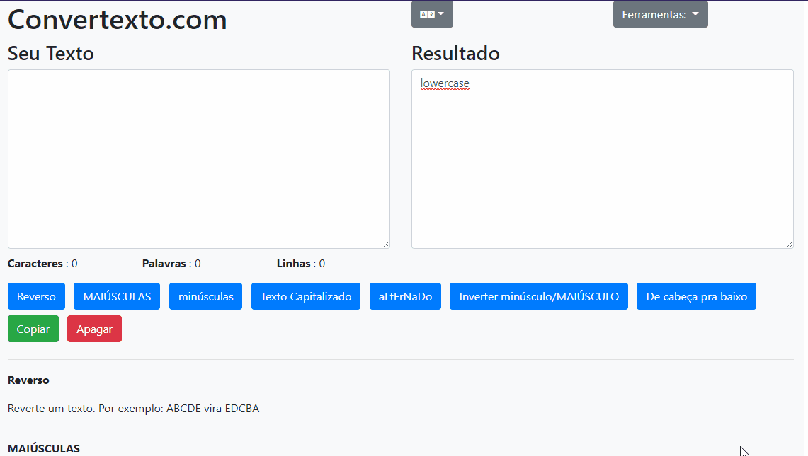

# Muda Texto
Site que tem como objetivo converter frases e palavras pra um padrão específico.
Exemplo, mudar "abc" para "ACB".

### Porque ?
Criei esse site pra praticar meu conhecimento com nodejs e express. 

### Como rodar
Necessário Docker Compose
1. ```npm install```  
2. ```npm run dev```  
3. No seu navegador: localhost:3000

### Exemplo

